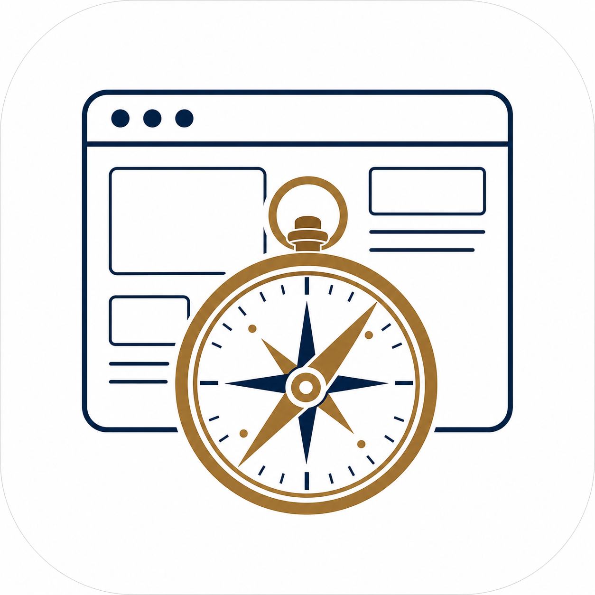

<p align="center"></p>

# web-legacy-compass

> **Observe the real user flow before modifying code.**

A coding-agent skill for tracing real legacy-web user flows — browser, API, business rule, database — into one evidence chain **before** you change frontend or API code.

Use it for feature work or debugging where request order, important payload fields, browser state, frontend console output, backend business exceptions, and database reads or writes must be correlated and recorded.

📦 **Promptbox listing:** <https://cskwork.github.io/promptbox/skills/web-legacy-compass/>

## Why

Unit tests pass but the real screen still breaks. HTTP 200 hides a business error. An endpoint name suggests one DB write but the code does three. Legacy flows entangle redirects, retries, polling, and background calls that a single API log can't capture.

This skill forces a **browser-to-database evidence chain** into a Markdown record *before* any code changes. You find the **earliest divergence** (root cause), not the loudest symptom.

## What it does

1. Creates a flow record at `docs/web-flows/YYYY-MM-DD-<slug>.md`.
2. Captures baseline + network/console trace **before** the first action.
3. Reproduces the exact user journey, one action at a time.
4. Builds the chain: `user action → DOM event → store → API client → controller → domain rule → transaction → query → DB write → side effect → response → render`.
5. Finds the earliest meaningful divergence.
6. Forms a testable, disproofable explanation.
7. Implements the minimal change.
8. Replays the **same** flow and compares before/after evidence.

Every claim is labeled: `runtime verified` · `test verified` · `code inferred` · `assumed` · `unavailable`.

## Install

```bash
git clone https://github.com/cskwork/web-legacy-compass.git
cd web-legacy-compass
./install.sh /path/to/your/project
```

This copies `SKILL.md`, `references/`, and `templates/` into `<project>/.agents/skills/web-legacy-compass/` and creates `<project>/docs/web-flows/` for records.

## Structure

```
.
├── SKILL.md                          # the skill definition (frontmatter + workflow)
├── references/
│   ├── BROWSER-TOOL-ROUTING.md       # Playwright CLI vs Chrome DevTools MCP vs Ego Lite vs agent-browser
│   ├── EVIDENCE-MODEL.md             # evidence levels, important-payload rule, DB/data mapping, logging
│   └── SUBAGENT-PATTERN.md           # one browser owner, parallel analysis roles, merge procedure
├── templates/
│   └── FLOW-RECORD.md                # 13-section Markdown template for the investigation record
├── install.sh                        # copies the skill into a target project
├── docs/                             # GitHub Pages source (onboarding site)
│   └── index.html
└── .github/workflows/deploy.yml      # deploys docs/ to GitHub Pages
```

## Browser tool routing (summary)

| Priority | Tool | Role |
|---|---|---|
| 1st | Playwright CLI | compact reproduction, trace, ordered request capture (default) |
| 2nd | Chrome DevTools MCP | exact inspection, escalation (precise body, sourcemaps, perf) |
| opt | Ego Lite | only when shared inherited login is a hard constraint |
| opt | agent-browser | only if already standardized; validate nav-capture limits first |

See [`references/BROWSER-TOOL-ROUTING.md`](references/BROWSER-TOOL-ROUTING.md) for the full decision table.

## License

MIT
